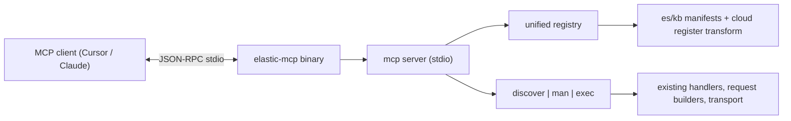

# Turn the CLI into an MCP server

## Goal

Add a second entrypoint to the package — `elastic-mcp` — that runs an MCP (Model Context Protocol) server over http/sse. It exposes three tools that together cover every Cloud, Elasticsearch, and Kibana HTTP API the CLI already supports:

- `**discover**` — filtered listing of available commands (by surface, namespace, free-text query)
- `**man**` — full JSON Schema + transport metadata for a single command (the manual page)
- `**exec**` — execute a command with a validated input object (or dry-run)

`docs`, `sanitize`, `config`, and ES helpers (`stack.es.helpers.*`) are **out of scope** since they aren't raw HTTP APIs.

## Why this fits the existing architecture

The CLI already has the perfect substrate:

- ES, Kibana, Cloud each expose a flat list of declarative API definitions (`EsApiDefinition`, `KbApiDefinition`, `CloudApiDefinition`).
- Every definition resolves to a single Zod input schema (existing in [packages/es-schemas](packages/es-schemas/) for ES; built at registration time by [src/kb/register.ts](src/kb/register.ts) and [src/cloud/register.ts](src/cloud/register.ts)).
- The `defineCommand` factory in [src/factory.ts](src/factory.ts) already does Zod-validate-then-route via `--help --json` for schema export and policy enforcement via `isCommandAllowed`.
- Cheap manifests (`apiManifest`, `kbApiManifest`) avoid loading 1,000+ schema files at server startup.

The MCP server is a thin protocol shell that reuses these primitives.

## High-level flow




## Tool input/output contracts

`discover` (input):

```ts
{ surface?: 'es' | 'kb' | 'cloud', namespace?: string, query?: string, limit?: number, offset?: number }
```

Returns `{ total, results: [{ id, surface, description, method, path, namespace }] }`. Filtered through the active `isCommandAllowed` policy so admin/profile restrictions apply transparently.

`man` (input): `{ id: string }`. Returns `{ id, surface, description, method, path, input_schema, response_type?, body_format? }`. `input_schema` is `z.toJSONSchema(...)` with `found_in` stripped via the existing `stripTransportMeta` helper from `src/factory.ts`.

`exec` (input):

```ts
{ id: string, input?: object, dry_run?: boolean, context?: string }
```

- `input` matches the schema returned by `man` (schema keys, not kebab CLI flags).
- `dry_run` returns the resolved HTTP request `{ method, path, querystring?, body? }` without executing.
- `context` lets the agent override the active context per-call (mirrors `--use-context`).

## Files to add

- `src/mcp/registry.ts` — unified inventory. Iterates `apiManifest`, `kbApiManifest`, and `[...allCloudApis, ...allServerlessApis]`. Replicates the renaming/promotion logic in [src/cloud/register.ts](src/cloud/register.ts) (`PROMOTED_NAMESPACES`, `HOSTED_NAMESPACE_RENAMES`, `simplifyProjectCommandName`, `CROSS_PROJECT_NAMESPACES`) so dot-path IDs match the CLI exactly (e.g. `cloud.serverless.projects.search.list`, `stack.es.indices.create`). Extract this transform into a small shared helper used by both `register.ts` and the registry to avoid drift.
- `src/mcp/tools/discover.ts` — substring match across `id` and `description`; honors `surface`/`namespace` filters and policy.
- `src/mcp/tools/man.ts` — lazy-loads the full definition (ES via `loadEsApi`, Kibana via `loadKbApi`, Cloud already eager); for KB/Cloud reuses `buildCommandSchema()` from each `register.ts` (extract this into a shared helper). Calls `z.toJSONSchema(schema, { reused: 'ref' })` and runs the result through `stripTransportMeta`.
- `src/mcp/tools/exec.ts` — validates `input` against the same Zod schema using the same passthrough + JSON-body-relaxation logic the factory uses (factor that block out of `src/factory.ts` into `src/lib/validate-input.ts` so both call sites share it). Then synthesizes a `ParsedResult` and calls one of `createEsHandler(def, schemaArgs)`, `createKbHandler(def)`, `createCloudHandler(def)`. For `dry_run`, calls the request builder (`buildRequestParams` / `buildKibanaRequestParams` / `buildCloudRequestParams`) directly and returns the resolved request without invoking transport.
- `src/mcp/server.ts` — wires the three tools into a `Server` from `@modelcontextprotocol/sdk` using `StdioServerTransport`. Each tool advertises its input JSON Schema and a description.
- `src/mcp/cli.ts` — entry point. Parses minimal flags (`--config-file`, `--use-context`, `--command-profile`) via `commander`, runs `loadConfig` → `setResolvedConfig` (same as [src/cli.ts](src/cli.ts)), then `await server.connect(transport)`. Errors before connection go to stderr; after connection, errors flow back through tool responses.
- `bin/elastic-mcp.js` — Node shim pointing at `dist/mcp/cli.js`, registered in [package.json](package.json) under `"bin"`.
- Tests:
  - `test/mcp/registry.test.ts` — every dot-path matches what `cli.ts` builds (sanity-check via Commander tree walk for a sample of each surface).
  - `test/mcp/discover.test.ts`, `test/mcp/man.test.ts`, `test/mcp/exec.test.ts` — unit tests with stub handlers/transport.
  - `test/mcp/server.test.ts` — protocol smoke test: spawn `node dist/mcp/cli.js`, exchange `initialize` + `tools/list` + a `tools/call` for `discover` and `man` with a mock config; assert structure of the JSON-RPC responses.

## Files to modify

- [src/factory.ts](src/factory.ts) — extract input validation block (lines ~748–795: passthrough wrap + body-field `z.any()` relaxation + `safeParse`) into `src/lib/validate-input.ts`. Export `stripTransportMeta` so the `man` tool can reuse it (currently file-local).
- [src/kb/register.ts](src/kb/register.ts) and [src/cloud/register.ts](src/cloud/register.ts) — export `buildCommandSchema` (currently module-private) so `man` can build the same Zod schema without re-instantiating the Commander tree.
- [src/cloud/register.ts](src/cloud/register.ts) — extract the namespace/command renaming logic (`PROMOTED_NAMESPACES`, `HOSTED_NAMESPACE_RENAMES`, `simplifyProjectCommandName`, etc.) into `src/cloud/dot-path.ts`. The registry imports the same helper so CLI IDs and MCP IDs cannot drift.
- [package.json](package.json):
  - Add `"elastic-mcp": "bin/elastic-mcp.js"` under `"bin"`.
  - Add `"@modelcontextprotocol/sdk"` to `dependencies` (latest stable; per AGENTS.md preference, don't pin to a hand-picked version — let `npm install` choose).
- [README.md](README.md) — add an "MCP server" section showing the JSON snippet for Cursor's `mcp.json` / Claude Desktop config.
- `tsconfig.json` if needed for the new entry (likely no change since `src/**` is already included).

## What gets reused (not rewritten)

- Config loading, contexts, profiles: [src/config/loader.ts](src/config/loader.ts), [src/config/store.ts](src/config/store.ts), [src/config/profiles.ts](src/config/profiles.ts).
- Auth + transport clients: [src/lib/transport.ts](src/lib/transport.ts), [src/lib/kibana-client.ts](src/lib/kibana-client.ts), [src/lib/cloud-client.ts](src/lib/cloud-client.ts).
- Per-surface handlers and request builders: `src/{es,kb,cloud}/handler.ts` and `request-builder.ts` (no changes needed; we just call them with a synthesized `ParsedResult`).
- Policy enforcement: `isCommandAllowed` from [src/factory.ts](src/factory.ts).

## Error contract

Tool responses follow the existing CLI error envelope `{ error: { code, message } }` so the same codes (`missing_config`, `command_blocked`, `input_validation_failed`, `transport_error`, `cloud_api_error`, `kibana_api_error`) propagate end-to-end. Exec returns successful JSON unwrapped at the top level.

## Edge cases handled

- ES cat APIs (`responseType: 'text'`) — when MCP `exec` is called, returning the parsed JSON via the existing `format=json` rewrite in `createEsHandler`.
- Bulk/msearch (`bodyFormat: 'ndjson'`) — works as-is since the request builder already handles this when given an array body field.
- Cloud `--wait` and `--save-as` — explicitly **not** exposed; these are CLI UX concerns, not HTTP-API semantics.
- KB multipart bodies — supported by the existing kibana-client; `exec` passes through.
- Unknown command IDs — `man`/`exec` return `{ error: { code: 'unknown_command', message: ... } }`.

## Test/build/dev plan

1. TDD per AGENTS.md: write failing tests for registry → discover → man → exec → server, in that order.
2. `npm run build` succeeds; `npm test` (which runs `node:test` with 90% coverage thresholds) stays green.
3. Manual smoke: configure Cursor with `{ "command": "node", "args": ["./dist/mcp/cli.js"] }`, verify `discover`, `man`, `exec` each round-trip cleanly against a local Elasticsearch + Kibana.
4. Lint: `npm run test:lint`, plus `npx tsc --noEmit` per AGENTS.md lesson #7.

